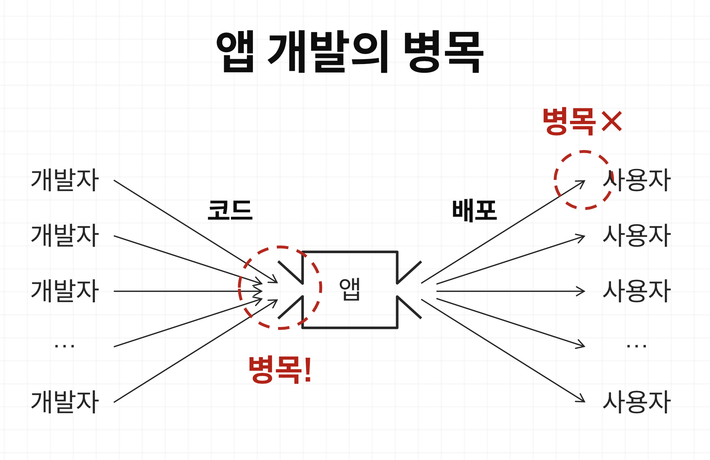
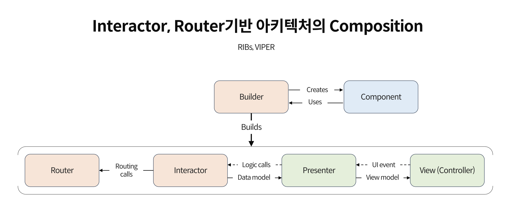
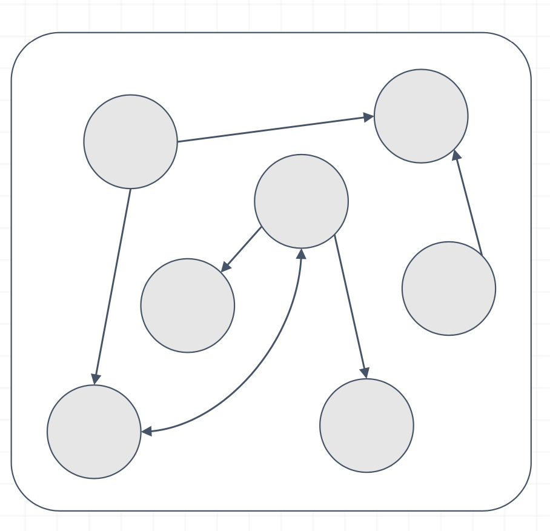
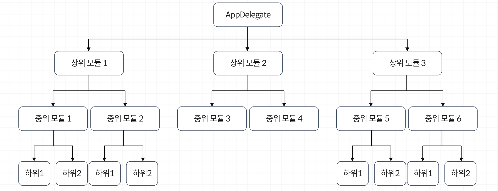
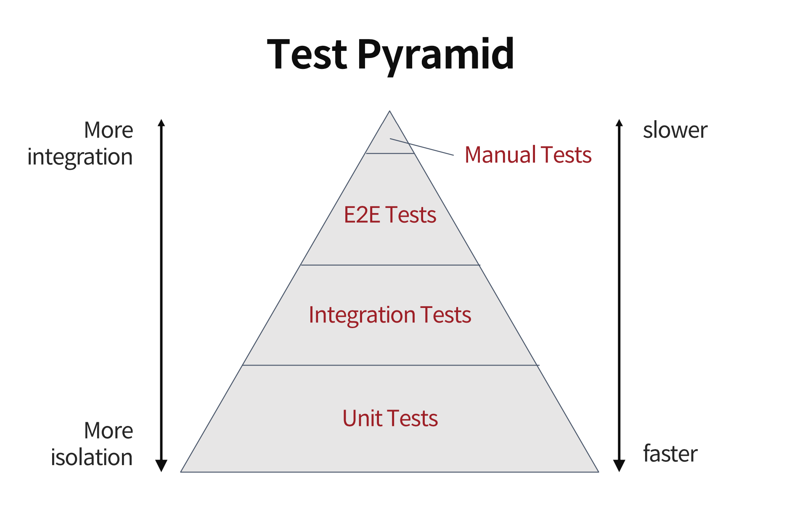

# Fastcampus 강의 요약 및 느낀점

- 강의: The RED : 슈퍼앱 운영을 위한 확장성 높은 앱 아키텍처 구축 by 노수진

---

## 1. 모바일 개발자의 Scalability와 앱 아키텍쳐

- 모바일 앱 서비스가 규모가 커지면, 함께 협업하는 개발자의 수가 많아지면서,
    
    하나의 프로그램에 다수 개발자의 코드가 몰릴 때 **병목**이 발생할 수 있습니다. 
    

    

- 개발자가 겪는 문제
    - 빌드시간 증가
    - 코드 충돌 증가
    - QA 디버깅 시간 증가
    - 개발 생산성 저하

- 사용자가 겪는 문제
    - 앱 startup 시간 증가
    - 과도한 자원사용 (베터리, 네트워크)
    - 앱 용량 증가
    - 버그 증가
    - 앱 안정성 하락

따라서, 확장 가능한 앱 아키텍처로 개발해야 하며, 특징들은 다음과 같습니다.

- **코드 레벨 아키텍처**: 로직을 분산, 객체를 조립해서 재사용 가능한 코드를 만드는 방법
- **모듈 아키텍쳐**: 유지 보수를 고려한 코드 구조 (여러 개발자가 동시에 효율적으로 일 할 수 있는 방법)
- **자동화된 테스트**: 유닛테스트, 스냅샷 테스트, 통합 테스트, E2E 테스트

---

## 2. 코드 레벨 아키텍처, 재사용 가능한 코드를 만드는 스킬

- **Composition**
    - 객체를 조립해서 쓰는 방식을 **Composition**이라고 합니다.
- Composition이 강력한 **아키텍처** 프레임워크 **RIBs**
    - **RIBs** is short for **Router**, **Interactor** and **Builder**, which are core components of this architecture.
        
        
        
- RIBs 아키텍처 각 Core Components들의 역할
    - `Router` : 네비게이션 역할 (Interacter와 ViewController를 연결)
    - `Interacter` : 코디네이션 역할 (비지니스 로직을 담당, Router로 Routing call, attach/ detach 요청 등)
    - `Builder` : 외부 디펜던시 역할, RIBs의 모든 구성요소를 생성 (Router, Interacter, View, Component)
    - `Component` : 외부 디펜던시 역할, Builder에서 Component를 통해 의존성 주입
    - `View` : ViewModel을 받아서 UI 업데이트, UIEvent를 Presenter로 전달 등
    - `Presenter` : Interacter와 View간의 통신을 담당 (Logical calls를 받아서 View Model로 전환하여 View에 전달)
    

## 3. 모듈 레벨 아키텍쳐, 유지 보수와 개발 속도를 고려하는 모듈화

- 모듈화(Modularization)
    - 모노리틱 앱 구조
        

        
        - 단일 타겟 (모듈)
        - 객체 간 무분별한 참조
        - 코드 변경의 영향 범위 파악이 힘듦
        - 빌드 시간의 증가에 따른 생산성 저하
    - 모듈화 구조
        
        
        
        - 관심사 분리 및 코드 파악이 빠른 장점이 있다
- 느슨한 결합
    - 확장이 용이하고 재사용이 가능
    - 유지 보수가 쉽다
    - 병렬 개발이 가능
    - 테스트 용이성 (Testable)
- 의존성 주입 패턴
    - 위 **느슨한 결합**을 달성하기 위해서 의존성을 주입해줘야 한다
        - 사용하기전 Runtime에 초기화가 필요한 것
        - 아직 존재하지 않거나 개발 중인 것
        - 비결정론적 동작/알고리즘
        

## 4. 자동화된 테스팅

- 테스트를 통해서 소프트웨어가 잘 못 됐다는 걸 알아 낼 수 있다.
    - 아래 Test Pyrmid에 의해서 테스트의 `속도`와 `단위 or 통합의 정도`를 나타낼 수 있다
    

    
    - Unit Testing
        - 작은 단위의 기능 테스트 XCTests
        - 멀티쓰레딩 환경이 유닛 테스트 재연 가능성을 저해하는 방해물
            - 따라서, 테스트는 가능한 동기적으로 작동하게 만들어야 한다.
    - Snapshot Testing
        - 뷰를 유닛 테스트 할 수 있는 방법
        - 테스트를 최초로 돌렸을 때 snapshot 이미지를 저장해두고,
            
            다음 테스트 실행시 해당 이미지의 픽셀을 비교하여 일치 여부를 확인한다. (일치 여부에 대한 오차 범위는 조정 가능)
            
    - UI Testing
        - 임의로 유저의 동작을 코드로 구현하여 테스트하는 방법
    - Integration Testing
        - RIBs 단위로 통합 테스트가 가능하다. ( https://github.com/lyft/Hammer 활용 )
        - 단, 모듈화가 잘 되어 있는 아키텍쳐 코드 레벨에서 가능

## 5. 확장성 있는 인프라: 코드만으로 해결할 수 없는 문제들

- 피쳐 플래그 Feature Flags
    - 코드 변경이나 배포없이 프로그램의 동작을 변경 할 수 있게 하는 소프트웨어 개발 기법
    - Trunk Based Development with Feature Flags
- 품질 모니터링 (QEM)
    - 신규 버전 배포 이후 유저들이 앱을 잘 사용하고 있는지 사용자 경험은 어떤지 실시간으로 파악
        - 성공률: API 성공률, 주요  비지니스 로직 성공률
        - 소요시간: 앱 실행 시간, 대용량 데이터 불러오는 시간, API 응답 시간
        - 에러 종류: HTTP Response Code, System FrameWork Error Codes
    - 대시보드를 주기적으로 직접 확인하기 보다는, 대시보드를 언제 들여다 봐야하는지 알려주는 경보를 만드는 것이 좋다
        - Firebase Crashlytics에서 발생하는 오류에 대해 Slack과 이메일 등으로 경보 알림을 받고 있음.
- 회고 문화
    - Grab 회사에서는 서비스 도중 발생한 문제에를 해결한 이후, 솔직하고 날카로운 회고를 통해서 노하우를 축적하고
        
        재발 방지를하고 있습니다. 개발팀에서 회고에 대한 중요성을 인식하고 적극적으로 재발 방지를 위해 노력.
        

## **느낀점**

- 우버의 RIBs 아키텍처로 실질적으로 코드를 작성해 본적이 없었는데, 이번 수강을 통해서 처음부터 끝까지 코드를 작성해 볼 수 있어서 RIBs에 대한 이해를 높일 수 있었습니다.
- 모듈화 실습 과정이 상당히 도움이 된 것 같고, 에이블리 iOS 프로젝트에서도 부분적으로 적용해볼 수 있을 것 같다는 생각이 들었습니다.
- 테스트 코드가 과연 앱 안정성에 기여를 하는지 확신이 들지 않았었는데, 필요성을 느꼈고, 테스트가 가능한 코드 작성을 위한 노력이 필요할 것 같아요.
- 이슈 재발 방지를 위한 Grab의 적극적인 회고 문화가 인상적이였습니다.

